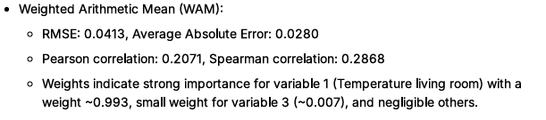
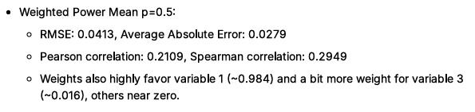
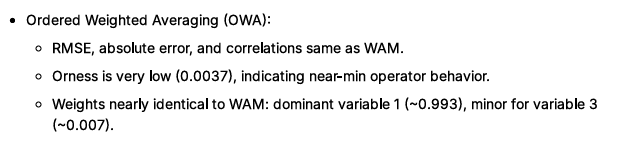
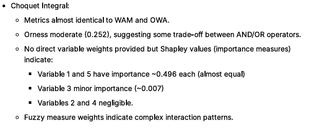

```{r}
# 0. Setup ----
required_pkgs <- c("readr","dplyr","ggplot2","GGally","corrplot",
                   "car","MASS","gridExtra","scales")
missing_pkgs <- required_pkgs[!(required_pkgs %in% installed.packages()[,"Package"])]
if (length(missing_pkgs)) {
  install.packages(missing_pkgs, repos = "https://cloud.r-project.org")
}
library(readr); library(dplyr); library(ggplot2); library(GGally); library(corrplot)
library(car); library(MASS); library(gridExtra); library(scales)
knitr::opts_chunk$set(echo = TRUE, message = FALSE, warning = FALSE)
data_path <- "ENB.txt"
```

```{r}
# 1. Read data ----
raw <- read_table2(data_path, col_names = FALSE, skip = 1, progress = FALSE)
is_num_col <- sapply(raw, is.numeric)
df_num <- raw[, is_num_col]
if (ncol(df_num) > 6) {
  df_num <- df_num[ , (ncol(df_num)-5):ncol(df_num)]
}
colnames(df_num) <- c("X1","X2","X3","X4","X5","Y")
df <- as.data.frame(df_num)
dim(df)
head(df)
```

There are 6 variables (5 predictors X1 to X5 and 1 response Y) in the dataset. Total observations are 19735.

# Statistical Summary

```{r}
# 2. Basic summary / missing values / types ----
summary_stats <- summary(df)
summary_stats
#sapply(df, function(x) sum(is.na(x)))
```

# Exploratory Data Analysis

## Univariate Analysis :

### Histogram and Boxplot

```{r}
# 3. Univariate plots (distribution) ----
plot_list <- list()
for (v in names(df)) {
  p_hist <- ggplot(df, aes_string(x = v)) +
    geom_histogram(aes(y = ..density..), bins = 30, fill = "steelblue", color = "white") +
    geom_density(alpha = 0.3, color = "red") +
    labs(title = paste("Histogram & density -", v)) +
    theme_minimal()
  p_box <- ggplot(df, aes_string(y = v)) +
    geom_boxplot(fill = "orange", alpha = 0.7) +
    labs(title = paste("Boxplot -", v)) +
    theme_minimal()
  plot_list[[paste0(v,"_hist")]] <- p_hist
  plot_list[[paste0(v,"_box")]] <- p_box
  print(p_hist)
  print(p_box)
}
```

Variables X1, X2,X5 and Y show potential outliers in boxplots. Right skewness is observed in X1,Y distributions. Left skewness is observed in X3 and X5.

```{r}
# 4. Pairwise relationships ----
GGally::ggpairs(df, columns = 1:6, progress = FALSE)
```

## Bivariate Analysis :

### Scatter Plots with regression lines

```{r}
# Choose the source matrix
src <- df  # or use the.data

# If there is a leading index column, drop it
if (ncol(src) == 7) src <- src[, 2:7, drop = FALSE]

# Ensure column names exist; assign if needed
if (is.null(colnames(src)) || !all(colnames(src) %in% c("X1","X2","X3","X4","X5","Y"))) {
  colnames(src) <- c("X1","X2","X3","X4","X5","Y")
}

# Set a 2x3 layout for five plots
op <- par(mfrow = c(2, 3), mar = c(4, 4, 2, 1))

plot(src[,"X1"], src[,"Y"], xlab = "X1: Living room temp (°C)", ylab = "Y: Appliances (Wh)",
     pch = 19, col = rgb(0,0,1,0.4), main = "X1 vs Y")
abline(lm(Y ~ X1, data = as.data.frame(src)), col = "red", lwd = 2)

plot(src[,"X2"], src[,"Y"], xlab = "X2: Living room humidity (%)", ylab = "Y: Appliances (Wh)",
     pch = 19, col = rgb(0,0,1,0.4), main = "X2 vs Y")
abline(lm(Y ~ X2, data = as.data.frame(src)), col = "red", lwd = 2)

plot(src[,"X3"], src[,"Y"], xlab = "X3: Office temp (°C)", ylab = "Y: Appliances (Wh)",
     pch = 19, col = rgb(0,0,1,0.4), main = "X3 vs Y")
abline(lm(Y ~ X3, data = as.data.frame(src)), col = "red", lwd = 2)

plot(src[,"X4"], src[,"Y"], xlab = "X4: Office humidity (%)", ylab = "Y: Appliances (Wh)",
     pch = 19, col = rgb(0,0,1,0.4), main = "X4 vs Y")
abline(lm(Y ~ X4, data = as.data.frame(src)), col = "red", lwd = 2)

plot(src[,"X5"], src[,"Y"], xlab = "X5: Pressure (mmHg)", ylab = "Y: Appliances (Wh)",
     pch = 19, col = rgb(0,0,1,0.4), main = "X5 vs Y")
abline(lm(Y ~ X5, data = as.data.frame(src)), col = "red", lwd = 2)

par(op)


```

Variables X1 and X3 show positive linear relationships with Y. Variables X2,X4 and X5 show weak or non linear relationships with Y.

## Correlation Analysis :

```{r}
# 5. Correlation matrix ----
cor_mat <- cor(df, use = "pairwise.complete.obs")
round(cor_mat, 3)
corrplot::corrplot(cor_mat, method = "ellipse", type = "upper", tl.cex = 0.8)
```

Correlations:

-   Strong positive correlation between X1 and X3

-   Strong positive correlation between X2 and X4

-   Moderate negative correlation between X2 and X5

-   Moderate negative correlation between X4 and X5

```{r}
# 6. Multicollinearity checks ----
X <- as.matrix(df[, c("X1","X2","X3","X4","X5")])
eigs <- eigen(cor(X))
cond_number <- sqrt(max(eigs$values) / min(eigs$values))
cond_number
lm_full <- lm(Y ~ X1 + X2 + X3 + X4 + X5, data = as.data.frame(df_num))
vifs <- car::vif(lm_full)
vifs
```

The condition number is 6.542, indicating weak multicollinearity overall in the entire model.. VIF \> 5 already indicates moderate multicollinearity with X1,X2,X3,X4 individually. This also translates to being strong correlations observed earlier then predictors are almost linearly dependent. This will cause instability in coefficient estimates and large standard errors. Also model may being sensitive to small changes in data. Also Variables X1 and X3 show positive linear relationships with Y. Variables X2,X4 and X5 show weak or non linear relationships with Y. Appropriate Transformations are applied next to reduce multicollinearity and improve model stability.

# Sample the data and aggregation

Data read from ENB.txt as df is used to sample with 650 rows into my.data dataframe. This sample is regarded for further aggregation model fit with .

1.  Address skewness by appropriate transformation

2.  Fit aggregation models : Linear programming is performed to find weights of predictor variables. lpSolve library used (source: AggWaFit718.R) to obtain optimum weights for respective aggregation.

#### 

```{r}
set.seed(226156731)
```

```{r}
num_row<-650
```

#read a random sample of 650 rows from the data

```{r}
the.data <- as.matrix(read.table("ENB.txt")) 
my.data <- the.data[sample(1:nrow(the.data),num_row), 2:7]
head(my.data)
```

```{r}
colnames(my.data)<- c("X1","X2","X3","X4","X5","Y")
head(my.data)
```

#min max normalization and z-score standardization functions

```{r}
# minmax normalisation
minmax <- function(x){
  (x - min(x))/(max(x)-min(x))
}

# z-score standardisation and scaling to unit interval
unit.z <- function(x){
  ((x-mean(x))/sd(x))
}
```

# Polynomial Transformations

⦁ Polynomial functions x^n^  can have  skewed distributions to look more like normal distributions.

⦁ For x^n^ ; 0\<n\<1 can be used when there are fewer very high values (positive skew), while n \> 1, when there are fewer very low values (negative skew). This transforms work well when the data is already on the unit interval (by applying min-max transformation).

Below is a practical, engineer style solution in R that mimics what you want (optimize over n), but using grid search or optimize() plus a normality criterion such as Shapiro–Wilk p value .

## 1. Define a normality score for a given n

Maximize Shapiro–Wilk pvalue of x^n^ (higher p → closer to normal). It means, pick the exponent n that makes the transformed data x^n^ look most like a sample from a normal distribution, according to the Shapiro–Wilk normality test.​

#### What the Shapiro–Wilk pvalue tells you

⦁ The Shapiro–Wilk test checks the null hypothesis “the data come from a normal distribution.”​

⦁ High pvalue (e.g. \> 0.05): data are compatible with normality (no strong evidence against normal).

⦁ Low pvalue (e.g. \< 0.05): data deviate from normality.​ So if you apply the test to the transformed data x^n^ as shapiro.test(x^n^)\$p.value, a larger pvalue means that particular power n ,makes the distribution of x^n^ closer to normal (in the sense of this test). [@stats]

## 2.Grid search over  n∈[0,2]

For power transforms, a reasonable range is, e.g., n∈[0,2] or whatever makes sense for your data domain (ensuring x^n^ is defined).

The idea is the grid is all candidate n, the score is the Shapiro pvalue for x^n^, and you choose the n that maximizes that score to make x^n^ as close to normal as this test can detect.

#Grid search over with lambda values from 0 to 2 in steps of 0.05 with with Shapiro–Wilk test of normalization

```{r . Grid search over with lambda values from 0 to 2 in steps of 0.05 with Shapiro–Wilk test of normalization  }
normality_score_sw <- function(x, n) {
  x_t <- x ^ n
  # Remove NAs just in case
  x_t <- x_t[is.finite(x_t)]
  # Need at least 3 distinct values for a sensible test
  if (length(unique(x_t)) < 3) return(NA_real_)
  shapiro.test(x_t)$p.value
}

find_n_shapiro <- function(x, n_grid = seq(0, 2, by = 0.05)) {
  scores <- sapply(n_grid, function(n) normality_score_sw(x, n))
  # Exclude NA scores
  valid  <- !is.na(scores)
  if (!any(valid)) stop("No valid n in the grid (all transforms constant or invalid).")
  best_i <- which.max(scores[valid])
  list(
    n_opt   = n_grid[valid][best_i],
    p_opt   = scores[valid][best_i],
    grid    = n_grid,
    scores  = scores
  )
}


```

## 3. Apply transformations

1.  Apply polynomial transformation with optimal power scale of x by Shapiro–Wilk normality test.​

```{r transform variables}
I <- c( 'X1', 'X2', 'X3', 'X4', 'X5','Y')
variables_to_transform <- my.data[,I]
head(variables_to_transform)
res_swY=find_n_shapiro(variables_to_transform[,"Y"])
variables_to_transform[,"Y"]=variables_to_transform[,"Y"]^res_swY$n_opt
res_swX1=find_n_shapiro(variables_to_transform[,"X1"])
variables_to_transform[,"X1"]=variables_to_transform[,"X1"]^res_swX1$n_opt
res_swX2=find_n_shapiro(variables_to_transform[,"X2"])
variables_to_transform[,"X2"]=variables_to_transform[,"X2"]^res_swX2$n_opt
res_swX3=find_n_shapiro(variables_to_transform[,"X3"])
variables_to_transform[,"X3"]=variables_to_transform[,"X3"]^res_swX3$n_opt
res_swX4=find_n_shapiro(variables_to_transform[,"X4"])
variables_to_transform[,"X4"]=variables_to_transform[,"X4"]^res_swX4$n_opt
res_swX5=find_n_shapiro(variables_to_transform[,"X5"])
variables_to_transform[,"X5"]=variables_to_transform[,"X5"]^res_swX5$n_opt
head(variables_to_transform)

```

#### Table of power applied to variables

| Variable | Power | p value of normality test |
|----------|-------|---------------------------|
| X1       | 0.05  | 3.94e-07                  |
| X2       | 1.75  | 0.07                      |
| X3       | 0.65  | 5.35e-05                  |
| X4       | 0.05  | 1.52e-09                  |
| X5       | 2     | 6.11e-05                  |
| Y        | 0.05  | 6.11e-05                  |

: Powers applied to variables

Predictor variables are transformed to be near normal distribution without changing their characteristics

## Plots of transformed data

```{r}
hist(variables_to_transform[, "Y"], main = "Y", xlab = "Y")
```

```{r}
for (k in paste0("X", 1:5)) { hist(variables_to_transform[, k], main = k, xlab = k) }
```

# save transformed data

```{r}
data.transformed=variables_to_transform;
write.table(data.transformed, "balaji-transformed.txt")  
```

# source AggWaFit718.R

This is the library of various aggregations and weight fitting method

```{r}
source("AggWaFit718.R")
```

########################################## 

# Build models and investigate

```{r}
source("AggWaFit718.R")
```

```{r}
data.transformed_copy <- data.transformed
  #as.matrix(read.table("balaji-transformed.txt"))
```

Avoid zeros in scaled data for HM and GM. Shift or rescale the data so the minimum becomes a small positive number

```{r Avoid zeros in scaled data for HM and GM.. Shift or rescale the data so the minimum becomes a small positive number}
epsilon <- 1e-6
data.transformed_copy[data.transformed_copy == 0] <- epsilon

```

## Get weights for Weighted Arithmetic Mean with fit.QAM()

```{r}
fit.QAM(data.transformed_copy,output.1="WAM.txt",stats.1 = "WAM-stats.txt")
```

```{r}
data.transformed_copy[1,1]
```

```{r}
length(data.transformed[,6])
  
```



## Get weights for Power Mean p=0.5 and p=2 (Weighted Quadratic Mean), p=-1 (Weighted Harmonic Mean),p=0 (Weighted Geometric Mean) with fit.QAM()

```{r}
fit.QAM(data.transformed_copy,output.1="powermean0.5.txt",stats.1 = "powermean-stats0.5.txt",g=PM05,g.inv=invPM05)
fit.QAM(data.transformed_copy,output.1="powermeanQM.txt",stats.1 = "powermean-statsQM.txt",g=QM,g.inv=invQM)
fit.QAM(data.transformed_copy,output.1="powermeanHM.txt",stats.1 = "powermean-statsHM.txt",g=HM,g.inv=invHM)
fit.QAM(data.transformed_copy,output.1="powermeanGM.txt",stats.1 = "powermean-statsGM.txt",g=GM,g.inv=invGM)
```



")

"){#Weighted Power Mean GM Geometric Mean)}

")

## Get weights for Ordered Weighted Average with fit.OWA()

```{r}
fit.OWA(data.transformed_copy,output.1="OWA.txt",stats.1 = "OWA-stats.txt")
```



## Get weights for Choquet Integral with fit.choquet()

```{r}
fit.choquet(data.transformed_copy,output.1="choquet.txt",stats.1 = "choquet-stats.txt")
```

####################################### 

# Interpretation and comparison

-   All models except PowerMean QM show very similar predictive accuracy RMSE 0.0413) and correlation values 0.200.22 Pearson).

-   WAM, OWA, and Choquet have almost the same error metrics, but Choquet shows higher orness, capturing importance of variable 5 as well, unlike others that mostly focus on variable 1

-   Variable 1 Living room temperature) is consistently the dominant predictor across all models, with variable 3 Office room temperature) having minor influence. Choquet uniquely assigns significant importance to variable 5 Pressure), suggesting it captures interaction effects better.

-   The OWA model shows low orness, indicating strong bias toward minimum values, which may limit flexibility

-   Choquet Integral model balances variable contributions, including pressure X5, suggesting better modeling of interaction effects without overfitting.

-   Power Mean HM strongly biases towards variable 1, somewhat ignoring pressure and humidity variables, but correlation metrics indicate better predictive fit. It may be simpler and less flexible but not necessarily overfitting given improved correlations.

# Optimum Model Recommendation

-   Weighted Power Mean HM outperforms marginally in all error and correlation metrics, indicating better fit on the data

-   Choquet Integral provides richer interpretability with balanced importance between temperature and pressure, reflecting nuanced interactions

-   For purely predictive performance and simplicity, Weighted Power Mean HM is optimal

-   For interpretability and capturing interaction effects, Choquet Integral is preferable.

Overall, the Weighted Power Mean HM should be the first choice focusing on prediction accuracy, while Choquet Integral suits those valuing variable interaction understanding alongside good accuracy

# Use Model for Prediction on test data

-   Test data frame is prepared

-   Po

```{r imort new data}
# Your data
new.data <- c(23.5, 35.87125, 24.89, 32.93, 758.55)

# Create a matrix with 1 row and 5 columns
new.data <- matrix(new.data, nrow = 1)

# Assign column names
colnames(new.data) <- c("X1", "X2", "X3", "X4", "X5")

# Check result
new.data

```

```{r transform new data}
new_input_to_transform <- new.data
new_input_to_transform[,"X1"]=new_input_to_transform[,"X1"]^res_swX1$n_opt
new_input_to_transform[,"X2"]=new_input_to_transform[,"X2"]^res_swX2$n_opt
new_input_to_transform[,"X3"]=new_input_to_transform[,"X3"]^res_swX3$n_opt
new_input_to_transform[,"X4"]=new_input_to_transform[,"X4"]^res_swX4$n_opt
new_input_to_transform[,"X5"]=new_input_to_transform[,"X5"]^res_swX5$n_opt
new_input_to_transform
```

```{r predict Y using QM model}
# Load the weights from the best model (QM in this case
weights_QM <- c(0.934071643855891,0, 0.0659283561441099,0,0)
# call the function PM
result=PM(new_input_to_transform,weights_QM,-1)
  #QAM(  x = new_input_to_transform,  w = weights_QM,  g = QM,  g.inv = invQM)


```

```{r reverse transform Y to original scale}
result_scaled=result^(1/res_swY$n_opt)
result_scaled


```
