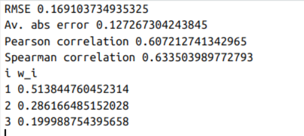
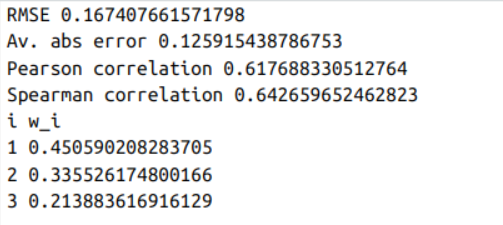
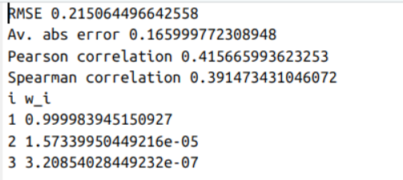
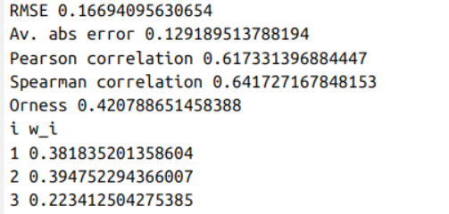

# Boston housing data

Construct a working model which has the capability of predicting the value of houses. 
The features 'RM', 'LSTAT' and 'PTRATIO' give us quantitative information about each data point. 
The Target variable, 'MEDV' is the variable we seek to predict.

Note: 
1) RM is the average number of rooms among homes in the neighbourhood
2) LSTAT is the % of homeowners in the neighbourhood considered *lower class / working poor*
3) PTRATIO is the ratio of students to teachers in primary and secondary schools in the neighbourhood

Use R Markdown to generate your report either as a HTML file or Word file.

### Load data

```{r}
df <- read.table("D:/Great Learning/Deakin GL/Real World Ananlytics/Week3/Part 1/housing.csv", sep = ",", header = TRUE)

```

### Checking the top  5 rows in the dataset

```{r}
head(df, 5)
View(head(df, 5))

```
### Last 5 rows

```{r}
tail(df, 5)
View(tail(df, 5))

```


### Checking the rows and columns in the dataset

```{r}
dim(df)
```
## Printing the output

```{r}
# Print the number of rows and columns 
# cat -"concatenate and print."
cat("Number of rows:", dim(df)[1], "\n") 
cat("Number of columns:", dim(df)[2], "\n")
```

### Checking the information about dataframe

```{r}
str(df)    # str -  Structure of data frame
```

### Checking the 5 point summary 


```{r}
summary(df)

```
### Transpose of Summary

```{r}

t(summary(df))

```


```{r}
# Transpose of summary

library(psych)

describe(df)

```


```{r}

desc_df = t(describe(df))
desc_df

### se -  Standard error -Std/sqrt(n)
### mad stands for Median Absolute Deviation - MAD =  median (|X-Median|)

```
## Saving output

```{r}

write.csv(desc_df, "describe_output.csv", row.names = TRUE)

```


### Checking for any missing values by columns

```{r}
missing_values <- colSums(is.na(df)) 
# Print the number of missing values in each column 
print(missing_values)
```

### Total missing values 

```{r}
total_missing = sum(is.na(df))
cat(total_missing)

```


### Load required libraries -plottig

``` {r}

## To plot graph
library(ggplot2)

# the color related library
# the color related library - It provides several color palettes
#install.packages("RColorBrewer", dependencies=TRUE)
library(RColorBrewer)

## Moments -To calculate statistical moments - Pearson’s/ kurtosis/ Skewness
#install.packages("moments")
library(moments)

```


### Ploting Univariate 


```{r}

# Plot for RM with labels
options(repr.plot.width = 8, repr.plot.height = 5)
ggplot(df, aes(x = RM)) +
  geom_histogram(binwidth = 0.5, fill = "blue", color = "black", size =0.5) +
  stat_bin(binwidth = 0.5, geom = "text", aes(label = ..count..), vjust = -0.5) +
  labs(title = "Distribution of RM", x = "Average Number of Rooms per Dwelling", y = "Frequency")
   


# aes -aesthetics - the function tells ggplot2 how to map variables in your data to visual properties of the plot.
# geom_histogram()- This function creates a histogram,size -line width
# stat_bin()- This function is used to calculate the number of observations in each bin of a histogram
# geom = "text"- This argument specifies that the layer should add text labels to the plot.
# vjust = -0.5- This argument adjusts the vertical position of the text labels

# Plot for LSTAT with labels
ggplot(df, aes(x = LSTAT)) +
  geom_histogram(binwidth = 2, fill = "green", color = "black") +
  stat_bin(binwidth = 2, geom = "text", aes(label = ..count..), vjust = -0.5) +
  labs(title = "Distribution of LSTAT", x = "Percentage of Lower Status Population", y = "Frequency")

# Plot for PTRATIO with labels
ggplot(df, aes(x = PTRATIO)) +
  geom_histogram(binwidth = 1, fill = "red", color = "black") +
  stat_bin(binwidth = 1, geom = "text", aes(label = ..count..), vjust = -0.5) +
  labs(title = "Distribution of PTRATIO", x = "Pupil-Teacher Ratio by Town", y = "Frequency")

# Plot for MEDV with labels
ggplot(df, aes(x = MEDV)) +
  geom_histogram(binwidth = 50000, fill = "purple", color = "black") +
  stat_bin(binwidth = 50000, geom = "text", aes(label = ..count..), vjust = -0.5) +
  labs(title = "Distribution of MEDV", x = "Median Value of Owner-Occupied Homes", y = "Frequency")


```
### Option-2 - Plotting graphs with simple code


```{r}

# RM
h <- hist(df$RM,
          main = "Distribution of RM",
          xlab = "Average Number of Rooms",
          col = "lightblue",
          border = "black")
text(x = h$mids, y = h$counts, labels = h$counts, pos = 3)

# PTRATIO
h <- hist(df$PTRATIO,
          main = "Distribution of PTRATIO",
          xlab = "Pupil-Teacher Ratio",
          col = "lightgreen",
          border = "black")
text(x = h$mids, y = h$counts, labels = h$counts, pos = 3)

# LSTAT
h <- hist(df$LSTAT,
          main = "Distribution of LSTAT",
          xlab = "% Lower Status Population",
          col = "lightpink",
          border = "black")
text(x = h$mids, y = h$counts, labels = h$counts, pos = 3)

# MEDV
h <- hist(df$MEDV,
          main = "Distribution of MEDV",
          xlab = "Median Value of Homes",
          col = "lightyellow",
          border = "black")
text(x = h$mids, y = h$counts, labels = h$counts, pos = 3)
# pos = 3 means the count labels are drawn above each bar.


```


# Saving image file 

```{r}
png("histogram.png", width = 800, height = 600)

h <- hist(df$RM,
          main = "Distribution of RM",
          xlab = "Average Number of Rooms",
          col = "lightblue",
          border = "black")

text(x = h$mids,
     y = h$counts,
     labels = h$counts,
     pos = 3,
     col = "black")

dev.off()   # closes the device


#h$mids: center of each bin (used for x-position)
#h$counts: height of each bar (used for y-position and labels)
#pos = 3: places labels above the bars
#text(): overlays the count labels

getwd()


#jpeg("histogram.jpg", width = 800, height = 600)
# same plotting code here
#dev.off()


#pdf("histogram.pdf", width = 7, height = 5)
# same plotting code here
#dev.off()


#tiff("histogram.tiff", width = 800, height = 600, res = 300)
# same plotting code here
#dev.off()

```


### Bivariate plots


```{r}

# Plot for RM vs MEDV
ggplot(df, aes(x = RM, y = MEDV)) +
  geom_point(color = "blue") +
  labs(title = "RM vs MEDV", x = "Average Number of Rooms per Dwelling", y = "Median Value of Owner-Occupied Homes")

# Plot for LSTAT vs MEDV
ggplot(df, aes(x = LSTAT, y = MEDV)) +
  geom_point(color = "green") +
  labs(title = "LSTAT vs MEDV", x = "Percentage of Lower Status Population", y = "Median Value of Owner-Occupied Homes")

# Plot for PTRATIO vs MEDV
ggplot(df, aes(x = PTRATIO, y = MEDV)) +
  geom_point(color = "red") +
  labs(title = "PTRATIO vs MEDV", x = "Pupil-Teacher Ratio by Town", y = "Median Value of Owner-Occupied Homes")

```

### Option-2 - Plotting bi-variate graphs with simple code


```{r}
# RM vs MEDV
plot(df$RM, df$MEDV,
     main = "RM vs MEDV",
     xlab = "Average Number of Rooms per Dwelling",
     ylab = "Median Value of Owner-Occupied Homes",
     col = "blue",
     pch = 19)

# LSTAT vs MEDV
plot(df$LSTAT, df$MEDV,
     main = "LSTAT vs MEDV",
     xlab = "Percentage of Lower Status Population",
     ylab = "Median Value of Owner-Occupied Homes",
     col = "green",
     pch = 19)

# PTRATIO vs MEDV
plot(df$PTRATIO, df$MEDV,
     main = "PTRATIO vs MEDV",
     xlab = "Pupil-Teacher Ratio by Town",
     ylab = "Median Value of Owner-Occupied Homes",
     col = "red",
     pch = 19)


```

### Useful function for EDA -Multiple plots

``` {r}
# Multiple plot function
#
# ggplot objects can be passed in ..., or to plotlist (as a list of ggplot objects)
# - cols:   Number of columns in layout
# - layout: A matrix specifying the layout. If present, 'cols' is ignored.Arrangement of multiple plots on a single page
#
# If the layout is something like matrix(c(1,2,3,3), nrow=2, byrow=TRUE),
# then plot 1 will go in the upper left, 2 will go in the upper right, and
# 3 will go all the way across the bottom.

# ## Grid  - useful when creating complex graphs and charts that 
# require precise control over the layout and design of the plot

#
multiplot <- function(..., plotlist=NULL, file, cols=1, layout=NULL) {

  library(grid)

  # Make a list from the ... arguments and plotlist
  #The code plots <- c(list(...), plotlist) is used to combine 
  # multiple ggplot objects into a single list 
  plots <- c(list(...), plotlist)

  numPlots = length(plots)

  # If layout is NULL, then use 'cols' to determine layout
  if (is.null(layout)) {
    # Make the panel
    # ncol: Number of columns of plots
    # nrow: Number of rows needed, calculated from # of cols
    # seq - It generates sequence of numbers
    # ceiling - It identifies the number of rows required to display plots
    layout <- matrix(seq(1, cols * ceiling(numPlots/cols)),
                    ncol = cols, nrow = ceiling(numPlots/cols))
  }

 if (numPlots==1) {
    print(plots[[1]])

  } else {
    # Set up the page
     ## Viewport -  creates a new layout
    grid.newpage()
    pushViewport(viewport(layout = grid.layout(nrow(layout), ncol(layout))))

    # Make each plot, in the correct location
    for (i in 1:numPlots) {
      
      # Get the i,j matrix positions of the regions that contain this subplot
      ## arr.ind =  Array which is indexed with rows and columns output
      ## arr.ind =False means show only a vector
      ## Layout == i -  Matches the total layout available to plot
      matchidx <- as.data.frame(which(layout == i, arr.ind = TRUE))

      print(plots[[i]], vp = viewport(layout.pos.row = matchidx$row,
                                      layout.pos.col = matchidx$col))
    }
  }
}
```

### Initial visualization


``` {r}

### Quick Plot
p1 <- qplot(RM, MEDV, data = df, geom = c("point", "smooth")) + ggtitle("MEDV by RM") 
p2 <- qplot(LSTAT, MEDV, data = df, geom = c("point", "smooth")) + ggtitle("MEDV by LSTAT")
p3 <- qplot(PTRATIO, MEDV, data = df, geom = c("point", "smooth")) + ggtitle("MEDV by PTRATIO")

multiplot(p1, p2, p3, cols=3)

```


### Observation

* In the first plot, we observe that RM and MEDV are positively correlated, meaning the more the value of RM, the more will be the value of MEDV. It is pretty evident that with increase in the number of rooms, the price of the house will increase.

* In the second plot, we observe that LSTAT and MEDV are negatively correlated, meaning the more the value of LSTAT, the less will be the value of MEDV. It is pretty evident that with increase in the lower class homeowners, then more likely very expensive real estate owners will not build their housing complexes in that region as most of the people will not be able to afford it.

* In the third plot, we observe that PTRATIO and MEDV are negatively correlated, meaning the more the value of PTRATIO, the less will be the value of MEDV. It is pretty evident that with increase in the students to teachers ratio, teachers will not be able to attend to students individually everytime and hence this may affect the education of students. So regions with a low PTRATIO will have higher prices for houses. 

* To summarize, the correlation between the feature variables and the target variable is as follows:
1. Negative correlation: LSTAT, PTRATIO
2. Positive correlation: RM

## Outlier Treatment

```{r}
# Step 1: Store  the variables to be transformed in a new dataframe, so as to not affect the original dataset
variables_to_transform <- df[]

# Let us take a look at the number of rows and columns in this selection
message("columns = ", ncol(variables_to_transform), "; rows = ", nrow(variables_to_transform))

# Step 2: create a table of same dimension as the variables_to_transform and initialize it with zero
data.transformed <- matrix(0, nrow(variables_to_transform), ncol(variables_to_transform))
```

```{r}
# Step 3:
# Function to remove outliers using IQR method
remove_outliers <- function(x) {
  q <- quantile(x, c(0.25, 0.75))
  iqr <- q[2] - q[1]                # Index value of probability value -q1 -0.25, q2 -0.75
  lower_bound <- q[1] - 1.5 * iqr
  upper_bound <- q[2] + 1.5 * iqr
  x_filtered <- x[x >= lower_bound & x <= upper_bound]
  return(x_filtered)
}

# Step 4: Analyse each column and treat outliers. Store the output in new matrix:

#Creating boxplots to view the outliers in the column RM prior to treatment
boxplot(df$"RM",main="Boxplot for RM")
# Measure skewness
skewness_value <- skewness(df$"RM")
message("Skewness for RM:", skewness_value, "\n")
# Remove outliers and update the data.transformed matrix
data.transformed[,1] <- NA
data.transformed[,1] <- ifelse(is.na(data.transformed[,1]), remove_outliers(df$"RM"), data.transformed[,1])


#Creating boxplots to view the outliers in the column LSTAT prior to treatment
boxplot(df$'LSTAT',main="Boxplot for LSTAT")
# Measure skewness
skewness_value <- skewness(df$"LSTAT")
message("Skewness for LSTAT:", skewness_value, "\n")
# Remove outliers
data.transformed[,2] <- NA
data.transformed[,2] <- ifelse(is.na(data.transformed[,2]), remove_outliers(df$"LSTAT"), data.transformed[,2])


#Creating boxplots to view the outliers in the column PTRATIO prior to treatment
boxplot(df$"PTRATIO",main="Boxplot for PTRATIO")
# Measure skewness
skewness_value <- skewness(df$"PTRATIO")
message("Skewness for PTRATIO:", skewness_value, "\n")
# Remove outliers
data.transformed[,3] <- NA
data.transformed[,3] <- ifelse(is.na(data.transformed[,3]), remove_outliers(df$"PTRATIO"), data.transformed[,3])


#Creating boxplots to view the outliers in the column MEDV prior to treatment
boxplot(df$"MEDV",main="Boxplot for MEDV")
# Measure skewness
skewness_value <- skewness(df$"MEDV")
message("Skewness for MEDV:", skewness_value, "\n")
# Remove outliers
data.transformed[,4] <- NA
data.transformed[,4] <- ifelse(is.na(data.transformed[,4]), remove_outliers(df$"MEDV"), data.transformed[,4])

```


Option -2 


```{r}


# Plot Boxplots for each variable
boxplot(df$RM, main="Outliers in RM", col = "lightblue")
boxplot(df$LSTAT, main="Outliers in LSTAT", col = "lightgreen")
boxplot(df$PTRATIO, main="Outliers in PTRATIO", col = "lightpink")
boxplot(df$MEDV, main="Outliers in MEDV", col = "lightyellow")


```
## Define Outlier Detection Function

```{r}
find_outliers <- function(x) {
  Q1 <- quantile(x, 0.25)       # 25th percentile
  Q3 <- quantile(x, 0.75)       # 75th percentile
  IQR <- Q3 - Q1                 # Interquartile range
  lower <- Q1 - 1.5 * IQR        # Lower bound
  upper <- Q3 + 1.5 * IQR        # Upper bound
  
  # Return the actual outlier values
  x[x < lower | x > upper]
}

```


## Apply on variable to know the exact values 

```{r}
# Detect outliers in each variable
find_outliers(df$RM)
find_outliers(df$LSTAT)
find_outliers(df$PTRATIO)
find_outliers(df$MEDV)

```

## Treat Outliers (Capping & Flooring)

```{r}
cap_floor <- function(x) {
  Q1 <- quantile(x, 0.25)
  Q3 <- quantile(x, 0.75)
  IQR <- Q3 - Q1
  lower <- Q1 - 1.5 * IQR
  upper <- Q3 + 1.5 * IQR
  
  # Replace values below lower bound with lower
  x[x < lower] <- lower
  
  # Replace values above upper bound with upper
  x[x > upper] <- upper
  
  return(x)
}

# Apply to selected columns
df$RM      <- cap_floor(df$RM)
df$LSTAT   <- cap_floor(df$LSTAT)
df$PTRATIO <- cap_floor(df$PTRATIO)
df$MEDV    <- cap_floor(df$MEDV)

```


## Verify After Treatment

```{r}
par(mfrow=c(2,2))  # 2x2 layout - par means parameter, mfrow - multiple figure by row


# RM
boxplot(df$RM, 
        main = paste("Box plot of RM after outlier treatment\nSkewness =", round(skewness(df$RM), 2)), 
        col = "lightblue")

# LSTAT
boxplot(df$LSTAT, 
        main = paste("Box plot of LSTAT after outlier treatment\nSkewness =", round(skewness(df$LSTAT), 2)), 
        col = "lightgreen")

# PTRATIO
boxplot(df$PTRATIO, 
        main = paste("Box plot of PTRATIO after outlier treatment\nSkewness =", round(skewness(df$PTRATIO), 2)), 
        col = "lightpink")

# MEDV
boxplot(df$MEDV, 
        main = paste("Box plot of MEDV after outlier treatment\nSkewness =", round(skewness(df$MEDV), 2)), 
        col = "lightyellow")

```


## Normalizing the Data
 
Judging by plots generated above, we would like to negatively transform some of our feature variables (LSTAT, PTRATIO), so that the effect of negative correlation is removed. 

Apart from this, we would like to normalize the all the variables (RM, LSTAT, PTRATIO, MEDV) as well.

```{r}
# Defining simple data transformation functions:

# 1. Min-Max transformation
min_max_transform <- function(x, input_data=x){
  min = min(input_data)
  max = max(input_data)
  mm_x = 1 * ((x - min)/(max - min))
}

# 2. Negative Min-Max Transformation
# The below negation function is taking care of scaling as well
negative_min_max_transform <- function(x, input_data=x){
  min = min(input_data)
  max = max(input_data)
  t_x = 1 - (x - min)/(max - min)
}
```


```{r}
# Applying data transformation function to the outlier-treated columns:
# Col #1: RM, Col #2 : LSTAT, Col #3: PTRATIO, Col #4: MEDV

data.transformed[,1]=min_max_transform(data.transformed[,1]) 
data.transformed[,2]=negative_min_max_transform(data.transformed[,2]) 
data.transformed[,3]=negative_min_max_transform(data.transformed[,3]) 
data.transformed[,4]=min_max_transform(data.transformed[,4]) 
```

# Fitting Aggregation Functions to data:

The fitting functions in AggWaFit718.r takes in data as its input where it treats the last column as our intended output values, and the other columns as input values. It then attempts to find weights for each input by minimising the error measure, which requires optimisation knowledge.

We have discussed these aggregation functions in the previous week. We will now apply them to our dataset.

Note: 
For all the functions defined in the file:
It generates two files output1.txt and stats1.txt in your working directory, the name of output files can be changed.
The last column in output1.txt is the fitted value

```{r}

# Installing the lpSolve package
#install.packages("lpSolve")

# Calling the lpSolve library
library(lpSolve)


# Reading the AggWaFit718.R file to use its functions
source("AggWaFit718.R")
```

### Weighted Arithmetic Mean
```{r}
# find the weights for a weighted arithmetic mean 
fit.QAM(data.transformed, output.1="AM-output.txt",stats.1="AM-stats.txt", g=AM, g.inv=invAM) # by default, it uses AM

output1<-readLines("AM-stats.txt")
print(output1)

```




###  Weighted power means with p=0.5, the outputs files are PM05output1.txt and PM05stats1.txt

```{r}
fit.QAM(data.transformed,output.1="PM05output1.txt",stats.1="PM05stats1.txt", g=PM05,g.inv = invPM05) # p = 0.5

#g=AM - defines how to transform the data (weights × scaled values).

#g.inv=invAM - defines how to bring predictions back to the original scale.

output3<-readLines("PM05stats1.txt")
print(output3)

```


###  Weighted power means with p=2, the outputs files are QMoutput1.txt and QMstats1.txt
```{r}
fit.QAM(data.transformed,output.1="QMoutput1.txt",stats.1="QMstats1.txt",g=QM,g.inv = invQM) # p = 2

output5<-readLines("QMstats1.txt")
print(output5)


```

#  Weighted geometric means, the outputs files are GMoutput1.txt and GMstats1.txt 
```{r}
fit.QAM(data.transformed,output.1="GMoutput1.txt",stats.1="GMstats1.txt",g=GMa,g.inv = invGMa) # GM

output7<-readLines("GMstats1.txt")
print(output7)


```

#  OWA, the outputs files are OWAoutput1.txt and OWAstats1.txt 
```{r}
fit.OWA(data.transformed,"OWAoutput1.txt","OWAstats1.txt") # OWA


output9<-readLines("OWAstats1.txt")
print(output9)


```


## Conclusion:

* By comparing the various outputs, we can infer that the lowest RMSE is 0.1669 (Ordered Weighted Average model).
* The highest RMSE is of the Weighted Geometric Mean model with the score as 0.215.
* Therefore, the best performing model is OWA.
* Interpreting the weights, the feature variables in decreasing order of importance are LSTAT, RM and PTRATIO, with almost equal weightage assigned to LSTAT and RM.