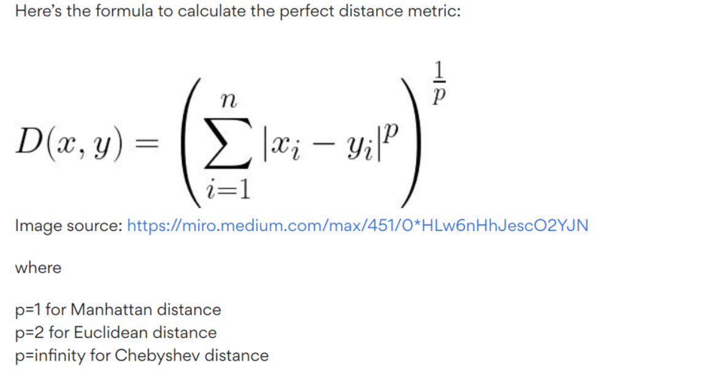
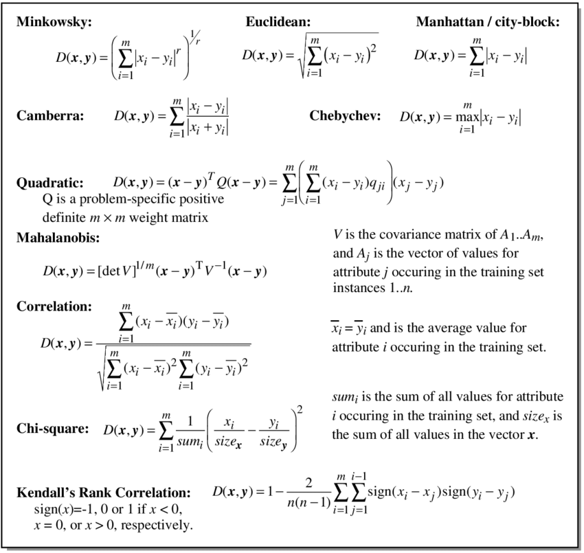

## Distance Functions:

A metric or distance function is a function d(x,y) that defines the distance between elements of a set as a non-negative real number. 

If the distance is zero, both elements are equivalent under that specific metric. Distance functions thus provide a way to measure how close two elements are, where elements do not have to be numbers but can also be vectors, matrices or arbitrary objects. 

Distance functions are often used as error or cost functions to be minimized in an optimization problem.



## Here is a summarized view of all the distance functions:




### Calculating Distances: 


```{r}

# Define a general function to find the Minkowski distance between two points.
# Based on the value of 'p', the distance measure will change.

minkowski_distance <- function(x,y,p) {
        (sum(abs(x-y)^p))^(1/p)
}

# Manhattan distance: p = 1
# Euclidean distance: p = 2


```


## Illustrative Example to find distances:
```{r}

# Install and load necessary packages
#install.packages("caTools")  # For sample.split
#install.packages("MASS")     # For Boston dataset
#install.packages("caret")    # For RMSE calculation
#install.packages("glmnet")   # For linear regression model

library(caTools)
library(MASS)
library(caret)
library(glmnet)

# Load the Boston dataset (example dataset in MASS package)
data(Boston)

# Set a seed for reproducibility
set.seed(123)

# Split the data into training and testing sets
split <- sample.split(Boston$medv, SplitRatio = 0.7)
train_data <- subset(Boston, split == TRUE)
test_data <- subset(Boston, split == FALSE)

# Create linear regression model
lm_model <- lm(medv ~ ., data = train_data)

# Make predictions on training and testing sets
train_predictions <- predict(lm_model, newdata = train_data)
test_predictions <- predict(lm_model, newdata = test_data)


# Get the summary of the linear model 
model_summary <- summary(lm_model) 
# Print the summary 
print(model_summary)

# Plot training predictions vs actual values
plot(train_data$medv, train_predictions, main = "Training Data: Actual vs Predicted",
     xlab = "Actual Values", ylab = "Predicted Values")
abline(0, 1, col = "red")

# Plot testing predictions vs actual values
plot(test_data$medv, test_predictions, main = "Testing Data: Actual vs Predicted",
     xlab = "Actual Values", ylab = "Predicted Values")
abline(0, 1, col = "red")


```

```{r}

```


## Calculating the L1 norm (Manhattan distance)
```{r}
# Calling the minkowski_distance function, and providing the train data and the predictions made on it as the first set of variables.

# Repeating the process to find the Manhattan distance between the test data and the predictions made on it.
# Setting p = 1, as L1 norm is being calculated

message("The Manhattan distance between the train data and the predictions made on the train dataset is ", minkowski_distance(train_data$medv, train_predictions, p = 1))

message("\nThe Manhattan distance between the test data and the predictions made on the test dataset is ",minkowski_distance(test_data$medv, test_predictions, p = 1))
```

## Calculating the L2 norm (Euclidean distance)
```{r}
# Calling the minkowski_distance function, and providing the train data and the predictions made on it as the first set of variables.

# Repeating the process to find the Euclidean distance between the test data and the predictions made on it.
# Setting p = 1, as L1 norm is being calculated

message("The Euclidean distance between the train data and the predictions made on the train dataset is ", minkowski_distance(train_data$medv, train_predictions, p = 2))

message("\nThe Euclidean distance between the test data and the predictions made on the test dataset is ",minkowski_distance(test_data$medv, test_predictions, p = 2))
```
## Inference: 

* The Euclidean distance in both cases, train vs train_predictions and test vs test_predictions, is much lower than the corresponding Manhattan distances.

* This is explained such that the Euclidean distance take the first root of the difference, whereas the Manhattan distance is the absolute difference between the values

## Error Measures


```{r}
# Calculating Error Measures:

# 1. Sum of Absolute Difference:

# As this is a specific case of Minkowski Distance, with p = 1, 
# we will reuse the function created previously, setting p = 1
calculate_SAD <- function(x,y,p = 1) {
        (sum(abs(x-y)^p))^(1/p)
}

# 2. Mean Absolute Error :
calculate_MAE <- function(x,y,p = 1) {
        (1/length(x))*(sum(abs(x-y)^p))^(1/p)
}

# 3. Sum of Squared Error:

# As this is a specific case of Minkowski Distance, with p = 2, 
# we will reuse the function created previously, setting p = 2
calculate_SSE <- function(x,y,p = 2) {
        (sum(abs(x-y)^p))^(1/p)
}

# 4. Mean Squared Error
calculate_MSE <- function(x,y,p = 2) {
        (1/length(x))*(sum(abs(x-y)^p))^(1/p)
}
```


## Illustrative Example to find error metrics:

```{r}
message("The Sum of Absolute Difference between the train data and the predictions made on the train dataset is ", calculate_SAD(train_data$medv, train_predictions))

message("\nThe Mean Absolute Error between the train data and the predictions made on the train dataset is ",
calculate_MAE(train_data$medv, train_predictions))

message("\nThe Sum of Squared Error between the train data and the predictions made on the train dataset is ",
calculate_SSE(train_data$medv, train_predictions))

message("\nThe Mean Squared Error between the train data and the predictions made on the train dataset is ",
calculate_MSE(train_data$medv, train_predictions))
```
## Inference:

* On comparing the various error metrics for train set and the predictions made on the train set, the decreasing 
order of values in errors is:
Sum of Absolute Difference > Sum of Squared Error > Mean Absolute Error > Mean Squared Error

* There is a large gap between the values in consecutive errors, as ordered above.
